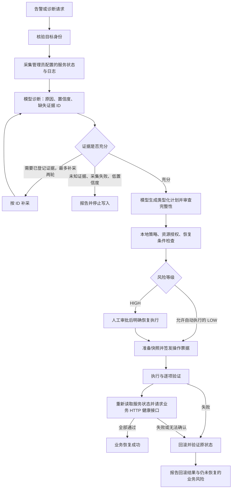

# 服务异常与 HTTP 恢复闭环

本功能在 `feat/evidence-recovery-loop` 分支实现，准备随 v0.5.0 发布；已发布的 v0.4.3 归档不包含这些变更。部署本功能需要使用同为 0.5.0 的控制端、内置插件和目标端构建产物，不能只替换配置文件。升级顺序见 [v0.5.0 发布说明](../release/v0.5.0.md)。



## 部署顺序

1. 按 [安装指南](../install.md) 构建或安装对应版本的控制端和目标端。控制端必须使用 **systemd 247 或更新版本**，以便通过 `LoadCredential` 把每个插件需要的密钥单独传入；目标端应能运行 systemctl 和 journalctl。先以只读方式接入。
2. 用 `a4diag target bootstrap` 生成目标材料。管理员在 `target-install.json` 的 `managed_resources` 中登记业务服务，例如 `{"capability":"services","resource":"myapp.service"}`，并按安装指南确认授权、安装目标端。这项登记同时限定服务读取与可接受的服务操作范围；控制端只读模式仍禁止写入。文件证据只能读取已登记的受管目录内普通文件。
3. 在控制端保存模型 API 密钥为 `/etc/a4diag/secrets/model-api-key`，所有者为 `a4diag:a4diag`、权限 `0600`。使用安全的管理员输入方式写入，不要把密钥写进 JSON、Git 或命令行参数。目标 bootstrap 自动生成的私钥也由该服务账户持有。
4. 完成 SSH host key 的人工核对及 known_hosts 配置。将下面字段合入已有的初始化请求，再运行 `sudo a4diag init --input /root/init.json`。`init` 会探测模型结构化输出和目标身份，然后激活插件配置。
5. 检查 `a4diag self-check --offline`、`systemctl status a4diag-core.service` 及各插件日志。离线 self-check 只检查配置；必须额外触发一次实际诊断，核对证据、模型诊断及业务检查结果。
6. 经测试确认后，才将初始化请求改为 `global_mode: read_write`、`write_confirmation: ENABLE`，并为目标开启 `write_enabled` 和所需的 `auto_execute_low`。HIGH 计划仍需审批和 `a4diag resume TRANSACTION`。

## 配置与模型接入

下面是可合入 `init --input` JSON 的字段示例。替换模型服务地址、模型名、目标连接信息和业务健康地址；保留原有身份密钥及 SSH 字段。

```json
{
  "global_mode": "read_only",
  "model": {
    "plugin": "model-openai-compatible",
    "base_url": "https://model.example.com/v1",
    "model": "YOUR_MODEL_NAME",
    "api_style": "openai",
    "api_key_ref": "file:model-api-key"
  },
  "targets": [{
    "id": "target-1",
    "mode": "ssh",
    "host": "192.0.2.10",
    "port": 22,
    "user": "a4diag-target",
    "transport": "transport-ssh-target-1",
    "identity_file_ref": "file:targets/target-1/ssh-ed25519",
    "known_hosts_ref": "file:targets/target-1/known_hosts",
    "operation_signing_key_ref": "file:targets/target-1/operation-ed25519.pem",
    "write_enabled": false,
    "auto_execute_low": false,
    "minimum_confidence": 0.7,
    "capabilities": [{"name": "services", "actions": ["restart", "start"], "resources": ["myapp.service"]}],
    "evidence_sources": [
      {"id": "service-state", "kind": "service_state", "resource": "myapp.service", "initial": true},
      {"id": "service-logs", "kind": "service_logs", "resource": "myapp.service", "initial": true, "max_bytes": 8192}
    ],
    "recovery_checks": [
      {"id": "service-active", "kind": "service_active", "resource": "myapp.service", "attempts": 3},
      {"id": "business-api", "kind": "http", "resource": "https://app.example.com/health/ready", "expected_status": 200, "body_contains": "\"ready\":true", "attempts": 3, "timeout_seconds": 3}
    ]
  }]
}
```

`api_style` 可为 `openai`、`azure`、`ollama`；Azure 还需要 `deployment` 与 `api_version`。初始化目前要求 HTTPS 服务地址，本地 HTTP Ollama 在模型插件层支持，但不能直接通过当前初始化 URL 校验；需要 HTTPS 代理。模型必须支持 JSON 对象输出。系统会给出精确 JSON Schema、可用操作的参数结构、授权资源及证据目录，仍会在本地校验每次输出。

`initial: false` 的证据源只会在模型明确请求其 ID 时补采。最多 8 个证据源，单项最多 16 KiB，总预算最多 64 KiB；日志是固定范围的有界采样，`truncated` 会明确标记，不能当作完整历史。日志发送给模型前会进行已有的敏感字段脱敏；管理员应选择确实需要的服务和文件。

HTTP 健康检查由**控制端**请求，不会从目标机发起；地址必须从控制端可达。检查使用 GET，不跟随重定向，不使用环境代理，不发送 API 密钥；HTTPS 使用系统 CA 验证。`body_contains` 是精确子串匹配，接口若有可变 JSON 空格，应提供稳定健康文本或只检查状态码。需要鉴权的健康接口目前不支持。

所有检查都必须通过。`service_active` 表示 systemd 单元已加载且 ActiveState=active；HTTP 检查用于补充实际业务就绪条件。一个健康接口不能证明所有业务路径都正常，管理员应选择覆盖本次服务故障的检查。

## 如何判断结果

- `insufficient_evidence`：证据不足、无法补采或置信度低，没有执行修复。
- `read_only_no_model`：模型不可用、格式不合法或计划审查不完整，没有执行修复。
- `policy_denied`：授权或恢复验证配置未满足；旧配置没有 `recovery_checks` 时不会继续自动写入。
- `succeeded` 且 `recovery_result.ok=true`：操作验证和所有配置的业务检查通过。
- `rollback_succeeded`：原始状态已恢复；若 `recovery_result.ok=false`，业务仍未确认恢复，需要人工处理。
- `rollback_partial` / `rollback_unknown`：回滚不完整或无法确认，应立即人工检查。

报告保留原始诊断证据、诊断结果、执行后证据和每项恢复检查结果。恢复执行时会重新核验当前配置的门槛，撤销恢复检查或提高置信度要求后，旧审批不能绕过这些检查。

测试使用实际模型插件与本地 HTTP 响应服务，覆盖协议、补采、拒绝执行和回滚；这不等于已验证某个外部模型在真实生产故障上的诊断质量。上线前应使用脱敏故障案例评估所选模型。
